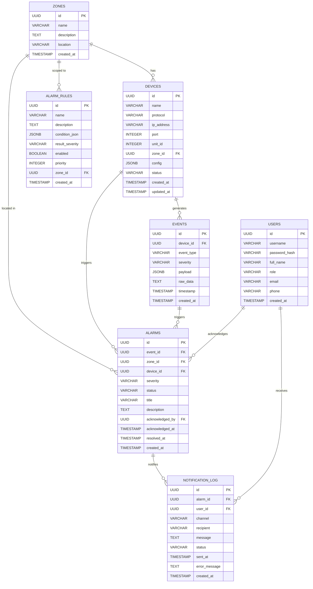

# Database ERD
## Emergency Hub Platform

---

## Entity Relationship Diagram

---

## Table Descriptions

### zones
Area/zona di pabrik PT Pupuk Kujang. Seed data: ZONE-A (Produksi), ZONE-B (Gudang Ammonia), ZONE-C (Utilitas), ZONE-D (Kantor/Command Center), ZONE-E (Loading/Unloading).

### devices
Master data device/panel/sensor. Field `config` (JSONB) menyimpan konfigurasi spesifik per-protokol (register map untuk Modbus, topic untuk MQTT, dll).

### events
Log semua raw event yang masuk dari device. High-volume table — pertimbangkan partitioning by timestamp atau migrasi ke TimescaleDB jika diperlukan.

### alarm_rules
Definisi rule untuk alarm engine. Menggunakan JSONB `condition_json` untuk fleksibilitas mendefinisikan kondisi tanpa perlu mengubah kode. Rules dievaluasi berdasarkan `priority` (ascending).

### alarms
Alarm instance yang dihasilkan oleh alarm engine. Lifecycle: ACTIVE → ACKNOWLEDGED → RESOLVED/CLOSED.

### users
Operator dan admin yang menggunakan platform. Fase 1 menggunakan in-memory users, migrasi ke database di fase 2.

### notification_log
Audit trail semua notifikasi yang pernah dikirim. Mencatat channel, recipient, status delivery, dan error message jika gagal.

---

## Indexes

| Table | Index | Columns |
|-------|-------|---------|
| devices | idx_devices_protocol | protocol |
| devices | idx_devices_status | status |
| devices | idx_devices_zone_id | zone_id |
| events | idx_events_device_id | device_id |
| events | idx_events_event_type | event_type |
| events | idx_events_timestamp | timestamp |
| alarms | idx_alarms_status | status |
| alarms | idx_alarms_severity | severity |
| alarms | idx_alarms_zone_id | zone_id |
| alarms | idx_alarms_created_at | created_at |
| notification_log | idx_notification_log_alarm_id | alarm_id |
| notification_log | idx_notification_log_status | status |
